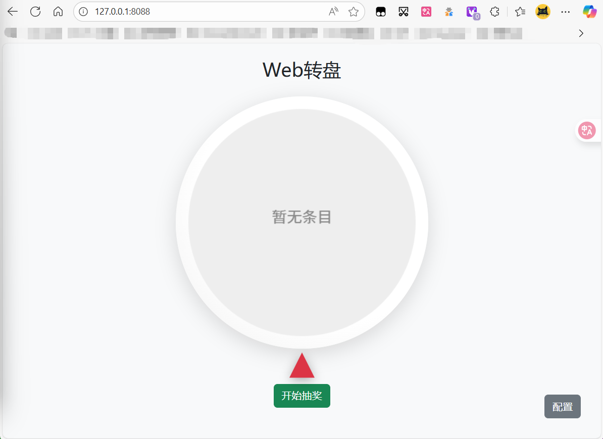

# WebTurnTable


## 项目简介
WebTurnTable 是一个基于 Spring Boot 的 Web 大转盘抽奖系统，支持自定义奖项。

## 技术栈
- Java 21
- Spring Boot
- Maven
- 前端：HTML（静态页面）
- Docker 支持

## 目录结构
```
├── src/main/java/top/cccg/webturntable/         # Java 源码
├── src/main/resources/                          # 配置与静态资源
│   ├── application.properties                   # Spring Boot 配置
│   ├── static/index.html                        # 前端页面
│   └── templates/                              # 预留模板目录
├── turntable_entries.json                       # 奖项数据
├── pom.xml                                      # Maven 配置
├── Dockerfile                                   # Docker 构建文件
├── mvnw, mvnw.cmd                               # Maven Wrapper
└── target/WebTurnTable-0.0.1-SNAPSHOT.jar       # 构建产物
```

## 构建方法
### 1. 本地构建 JAR 包
在项目根目录下执行：
```
./mvnw clean package
```
构建成功后，JAR 包位于 `target/WebTurnTable-0.0.1-SNAPSHOT.jar`。

### 2. Docker 镜像构建
确保已安装 Docker。
在项目根目录下执行：
```
docker build -t webturntable:latest .
```

## 运行方法
### 1. 直接运行 JAR 包
```
java -jar target/WebTurnTable-0.0.1-SNAPSHOT.jar
```
默认端口为 8088，可在 `src/main/resources/application.properties` 中修改。

### 2. 通过 Docker 运行
```
docker run -d -p 8088:8088 --name webturntable webturntable:latest
```

### 3. 在 1Panel 云服务器部署
1. 在 1Panel 后台新建自定义 Docker 应用。
2. 镜像名称填写 `webturntable:latest`（或上传镜像到仓库后填写仓库地址）。
3. 端口映射 8088:8088。
4. 启动容器即可。

## 访问方式
浏览器访问：
```
http://<服务器IP>:8088/
```

## 管理
- 管理密码配置在 `application.properties` 的 `turntable.admin.password` 字段。

## 其他
- 如需自定义奖项，请编辑 `turntable_entries.json` 文件。
- 如需更改端口或其他配置，请修改 `application.properties`或者直接在Web页面使用管理员密码更改。

---
如有问题欢迎反馈。

